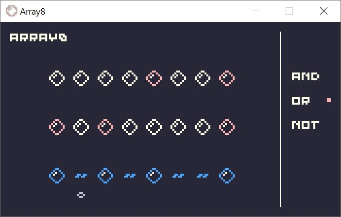

# Array8
An 8 step logic sequencer for music.

## WIP - Please don't judge my code. It's fuctional >_<
Prototype of an 8 step logic sequencer, flipping between 3 logic gates.
This sends messages to a Pure Data synth.
Hoping to build the final version in a more stable (time wise) language. ORRRR... Maybe this could be hardware???

